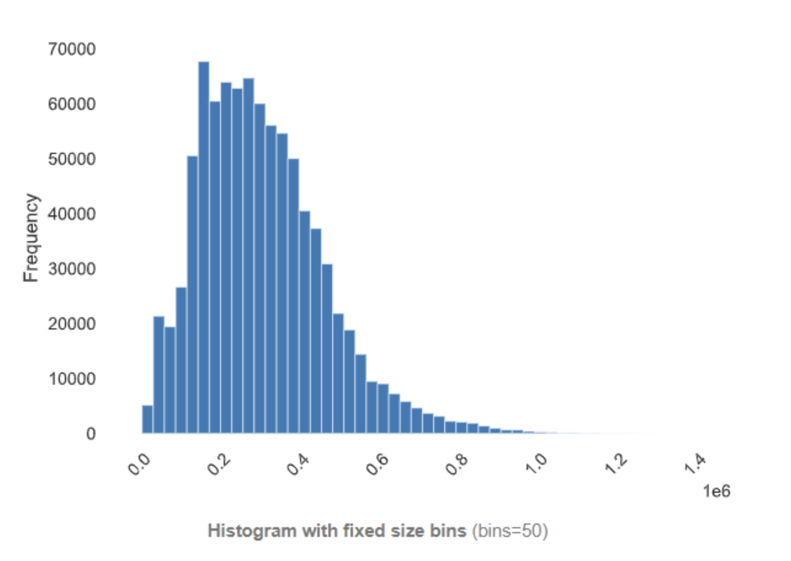

# General description
The following evaluation metrics are options that we have considered. However, to judge the efficacy of our models, we have decided on primarily using the mean absolute percentage error (MAPE) and median absolute percentage error (MdAPE). These evaluation metrics are best suited for our particular dataset due to property prices having a wider range of values, i.e. a percentage error indicates a similar proportion of impact be it for a $100,000 or a $10,000,000 property. This is crucial as the resale price has a heavy right-tailed distribution (see the figure below; also available in the EDA report) due to some properties having very high transaction prices. Furthermore, both the MAPE and the MdAPE are more easily understandable metrics as they are described in terms of percentages.

## Price histogram
Below is a histogram of resale property prices, which indicates a heavy right-tailed distribution.

# Primary model evaluations
In this section, we shall detail the performance metrics of the models that our team has created. Note that since this is only a primary stage of evaluation, we only compare the different models based on the five metrics that we have chosen, without any accompanying data visualisations.

## Biased model results
Please visit [this page](results-biased.md) to view the performance metrics of our models that have been trained using an arbitrary train-test split, i.e., the results of models tainted with lookahead bias. For more details this issue and our solution, please visit [this page](lookahead-bias.md).

A notable result is that of kNN regressor, where the MAPE was close to 0%, indicating that there must be some serious issue either with overfitting or with the training data.

## Unbiased model results
Please visit [this page](results-unbiased.md) to view the performance metrics of our models trained after fixing the lookahead bias.

As we can see, the best models are (in order of increasing MdAPE) rolling bagging regressor, rolling kNN regressor, and rolling XGBoost regressor. Hence we shall choose these three models for further analysis below.

## Description of selected models

### Rolling bagging regressor
The first of our models is the rolling bagging regressor. This model is an ensemble which fits a base regressor on random subsets of the original dataset before aggregating their individual predictions (either by voting or by averaging) to form a final prediction. The base regressor used was the default decision tree regressor. However, when used alone, the decision tree regressor results in high variance in the data. Hence, we chose to use an ensemble of decision trees to reduce the variance associated through randomisation and aggregation of results.

Overall, the bagging regressor performed relatively well with a MAPE of 0.082 and a MdAPE of 0.069.

### Rolling kNN regressor
The second selected model is the rolling kNN Regressor. This model averages the prices of the k nearest neighbours of every target to provide a prediction for the target’s price. After hyperparameter tuning using GridSearchCV and a scoring metric of negative RMSE, the selected hyperparameters for the model were k = 4, distance metric of manhattan distance, and weight function of “distance”. A weight function of “distance” means that the points are weighted by the inverse of their distance from the target, which implies that closer neighbours have a greater influence on the predicted price. 

The rolling kNN regressor model was chosen because of its simplicity as well as its stellar results. The rolling kNN regressor performed the best out of the three models chosen, with a MAPE of 0.064 and mdAPE of 0.047. 

### Rolling XGBoost regressor
Our final model is the XGBoost regressor. This model is also an ensemble which uses decision trees as the base regressor on random subsets before aggregating individual predictions to form a final prediction. However, the key differentiator of the XGBoost regressor is that the XGBoost algorithm utilises an optimised version of gradient boosting. Boosting, in this sense, involves building base estimators sequentially  with the aim of reducing the bias of the combined estimator. Gradient boosting expands on this by minimising the loss function of particular learners within the model. XGBoost then further optimises on gradient boosting by using L1 and L2 regularisation, which prevents overfitting and improves generalisation capabilities.

As expected, the rolling XGBoost regressor performed better than the unoptimised Bagging Regressor, with a MAPE of 0.065 and a MdAPE of 0.048, trailing behind the rolling kNN regressor, which will be delved into later.

# Extended model evaluations
In this section, we shall detail the three models that we have selected, namely rolling bagging regressor, rolling kNN regressor, and rolling XGBoost regressor in more depth through the use of data visualisations on the models' predictions.

All models perform poorly at the start of the period (which is in 1991) according to the MAPE and MdAPE metrics due to a lack of data from previous time intervals. In several towns, most notably Sembawang, the models perform exceptionally poorly across certain time periods due to sparsity of data in those time periods. For example, the number of data points each year for Sembawang is less than 10 from 1990 to 2001, with many years having only 2 data points. This lack of transaction data can be seen with [this visualisation](town-over-time-fig.html).

It can also be noted that across all chosen models, the mean absolute error is the highest for towns near the southern region of central Singapore, such as Bukit Merah (7.19/7.55/7.51), Queenstown (7.49/7.90/7.70) and Kallang (7.38/7.56/7.68) (from left to right: rolling bagging regressor, rolling XGBoost regressor, rolling kNN regressor). This is most likely due to the smaller number of datapoints for towns in said region across the entire timeframe, as indicated by the size of the bubbles in [this figure](town-overall-fig.html).

We list out the visualisations that support the above points below:

| |Rolling bagging regressor | Rolling kNN regressor | Rolling XGBoost regressor | 
|-|----|--------|----------|
| Per-HDB scatter mapbox of MAPEs |[baggingregressor-lat-lon-fig](./rolling-baggingregressor/baggingregressor-lat-lon-fig.html) | [knnregressor-lat-lon-fig](./rolling-knnregressor/knnregressor-lat-lon-fig.html) | [xgboost-lat-lon-fig](./rolling-xgboost/xgboost-lat-lon-fig.html)|
| Per-town scatter mapbox of MAPEs |[baggingregressor-town-fig](./rolling-baggingregressor/baggingregressor-town-fig.html) | [knnregressor-town-fig](./rolling-knnregressor/knnregressor-town-fig.html)| [xgboost-town-fig](./rolling-xgboost/xgboost-town-fig.html)|
| Per-town scatter mapbox of MdAPEs | [baggingregressor-town-fig-med](./rolling-baggingregressor/baggingregressor-town-fig-med.html) | [knnregressor-town-fig-med](./rolling-knnregressor/knnregressor-town-fig-med.html) | [xgboost-town-fig-med](./rolling-xgboost/xgboost-town-fig-med.html)|
| Per-town yearly scatter mapbox of MAPEs | [baggingregressor-time-town-fig](./rolling-baggingregressor/baggingregressor-time-town-fig.html) |[knnregressor-time-town-fig](./rolling-knnregressor/knnregressor-time-town-fig.html) | [xgboost-time-town-fig](./rolling-xgboost/xgboost-time-town-fig.html) |
| Per-town yearly line plot of MAPEs |[baggingregressor-mape-time-town](./rolling-baggingregressor/baggingregressor-mape-time-town.html) | [knnregressor-mape-time-town](./rolling-knnregressor/knnregressor-mape-time-town.html) | [xgboost-mape-time-town](./rolling-xgboost/xgboost-mape-time-town.html) |
| Per-town yearly line plot of MdAPEs |[baggingregressor-mdape-time-town](./rolling-baggingregressor/baggingregressor-mdape-time-town.html) |[knnregressor-mdape-time-town](./rolling-knnregressor/knnregressor-mdape-time-town.html) | [xgboost-mdape-time-town](./rolling-xgboost/xgboost-mdape-time-town.html) |
| Per-town yearly boxplot of MAPEs |[baggingregressor-mape-boxplot-town](./rolling-baggingregressor/baggingregressor-mape-boxplot-town.html) | [knnregressor-mape-boxplot-town](./rolling-knnregressor/knnregressor-mape-boxplot-town.html)| [xgboost-mape-boxplot-town](./rolling-xgboost/xgboost-mape-boxplot-town.html) |
| Heatmap of features (`actual` = target variable, `pred` = prediction) | [baggingregressor-heatmap](./rolling-baggingregressor/baggingregressor-heatmap.html)| [knnregressor-heatmap](./rolling-knnregressor/knnregressor-heatmap.html)| [xgboost-heatmap](./rolling-xgboost/xgboost-heatmap.html) |
| Per-town scatterplot of MAPEs (red line is overall model MAPE) | [baggingregressor-town-mape](./rolling-baggingregressor/baggingregressor-town-mape.png) | [knnregressor-town-mape](./rolling-knnregressor/knnregressor-town-mape.png) | [xgboost-town-mape](./rolling-xgboost/xgboost-town-mape.png)| 
