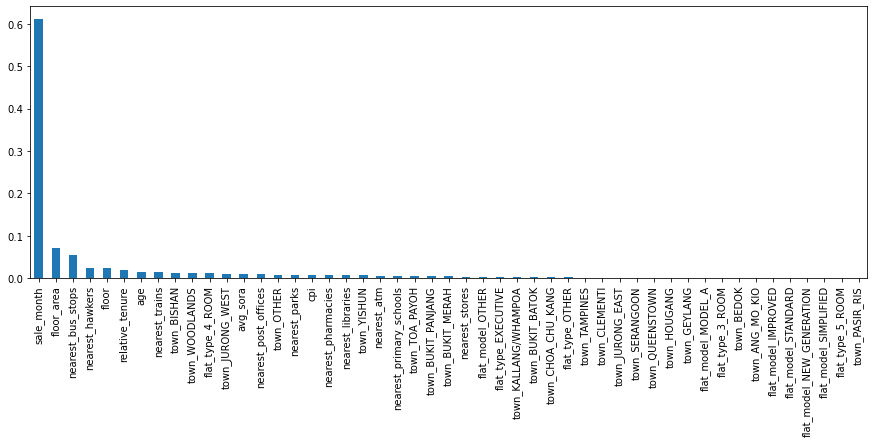
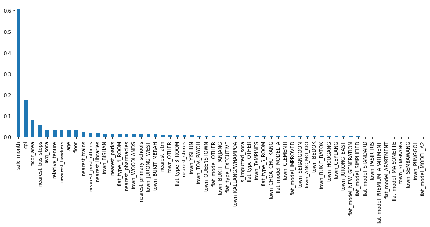

We’ll focus our discussion of feature importance using the XGBoost single model (the first figure below) for simplicity. The other feature importance plots are from our decision tree with recursive feature elimination (RFE), decision tree with AdaBoost, and decision tree with bagging regressor, in that order.

# Observations

{: style="height:20rem;"}
{: style="height:20rem;"}
{: style="height:20rem;"}
{: style="height:20rem;"}

(click on the figures to zoom in)

1. The flat attributes features, such as `sale_month`, `floor`, `age`, `floor_area`, have the highest importance. This is because these are well-known and fundamental features that determine a property’s value.
2. Next on importance are the economic indicator `avg_sora`, which indicates Singapore’s interest rate for the year, as well as cpi, which is the consumer price index of the current period.
3. Next on importance are the points of interest such as ATM’s, MRT and bus stops, hawker centres and schools.
4. Looking across the feature importance charts for XGBoost, decision tree with RFE, decision tree with AdaBoost, and decision tree with bagging regressor, they generally come to the same conclusion in feature importance, with a few of the more important features switching places with each other.
