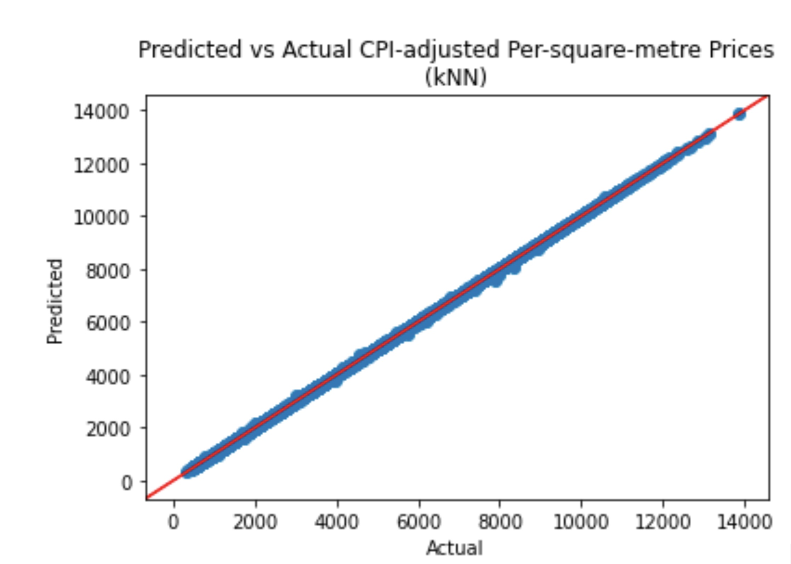

After looking at how the data was split, we realised that we have induced a lookahead bias in our models, as seen via the results from our biassed kNN regressor model's predictions (see below), where information that would have been unknown in a certain time period was being analysed. This was because our train test split was done by arbitrary sampling, which meant that the model learnt some mathematical relation to predict resale flat prices based on the sale month of the datapoint. 

To fix this issue, we took the most recent 4 years of data as our test set and our training set to be everything before said period. This way, the model would not have access to any data in the test set, which is in a future time period. After correcting for the lookahead bias and retraining our models, our team managed to produce a result that seems more reasonable. Note that this issue is only present in the non-rolling version of the models, as the rolling version uses a rolling period and instead of a simple train-test split.

## Biased kNN regressor predictions
We can see that the predictions are almost perfect, as indicated by the predictions following the red line very closely. Furthermore, the MAPE and MdAPE are 0.04% and 0.03% respectively, which confirms the near-perfect predictions and the lookahead bias present in the model.

{: style="height:20rem;"}