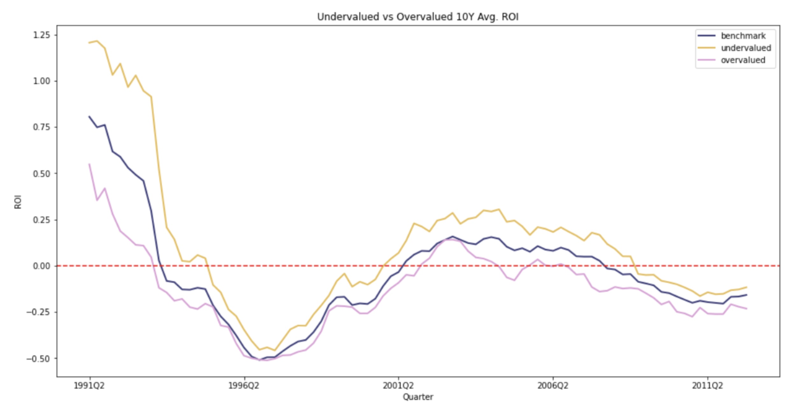

# General description

For this analysis, we aim to answer the following question: “If someone were to use our model to purchase a property identified as undervalued, would they see a good return on investment after 10 years?”

# Simulation 

Benchmark refers to the average return on investment of all the properties in the particular timeframe. In a certain time period, using our model we get the present value and the value 10 years from that time. Using these two values, we can compute the ROI. If ROI is above the red line, we will make a profit and vice versa. As the undervalued ROI is always above the benchmark ROI, our model successfully predicts which properties are undervalued, and vice versa for the overvalued.

## Assumptions
1. We are not accounting for one-off purchase costs, stamp duties, taxes, mortgage loans etc. Accounting for these would suppress some of the more optimistic ROI numbers that we see in this study.
2. We have access to the ground truth values, but we may have to use listing data instead for real-life usage.
3. Our model has a non-zero error rate hence there is some bias in our ROI computations.
